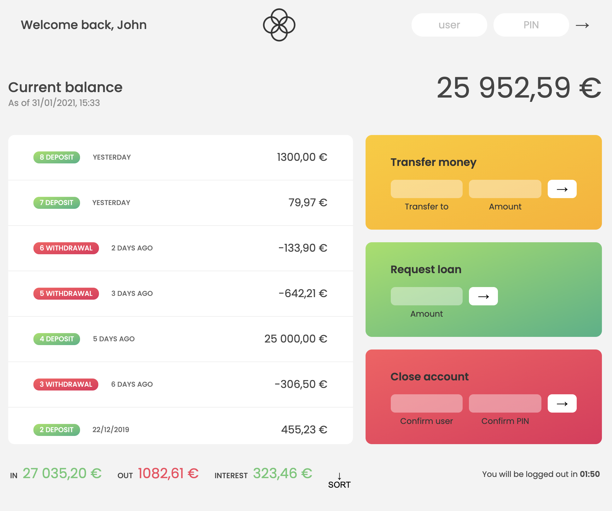

# Banking Application
### A simple banking application written in Javascript

I am learning new skills in Javascript and building new apps based on that learning. The flow chart shows you the functionality built into the app. This app is a simple banking app that allows you to:

- log in as a predetermined user 
- see your deposits and withdrawals
- transfer money to another account
- apply for a loan
- close your account.

Each account is localized, as in there is an entry in the user account that sets the region. Since this is a concept, the user details are contained within the script.

Each dynamic element changes dependent on the input. If you add a deposit it will reflect in the UI in the main screen, as well as the totals at the top and the bottom of the page. Similarly, the same will happen for transfers, withdrawals and loans.

There is a login timer that will time out after a preset period of time. If the user makes any transaction the timer will reset.

This isn't a prime time app - it works, but it is not secure and was built to better understand Javascript.

Predominately, this is built using ES6 (2020).

